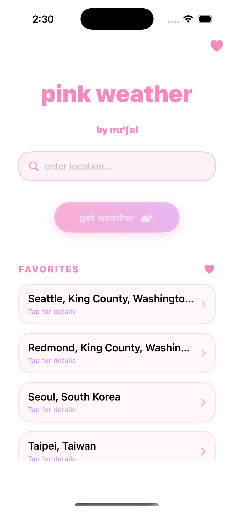

# 🌸 Pink Weather

A beautifully designed iOS weather app with a soft pink aesthetic, built with SwiftUI. Get instant weather updates for any location worldwide with an elegant, user-friendly interface.

## ✨ Features

- **🔍 Smart Location Search**: Enter any city, address, or landmark to get instant weather data
- **💝 Favorites System**: Save your favorite locations for quick access
- **🌡️ Comprehensive Weather Data**: Current temperature, precipitation, and hourly forecasts
- **🎨 Beautiful Pink Theme**: Carefully crafted color palette with gradients and shadows
- **💾 Persistent Storage**: Your favorites are saved locally and persist between app launches
- **📱 Modern SwiftUI Design**: Clean, intuitive interface with smooth animations

## 🎬 Demo

<div align="center" style="max-width: 300px; margin: 0 auto;">

### App Demo Video
[](https://www.youtube.com/shorts/XdDr4Tv8Pkc)

**[▶️ Watch on YouTube](https://www.youtube.com/shorts/XdDr4Tv8Pkc)**

*See Pink Weather in action - from searching locations to saving favorites*

</div>

## 🎨 Design

The app features a distinctive pink color scheme:
- **Primary Pink**: `rgb(242, 140, 191)` - Main branding and accents
- **Secondary Purple**: `rgb(217, 153, 242)` - Gradients and highlights  
- **Accent Pink**: `rgb(255, 217, 230)` - Backgrounds and subtle elements

The design emphasizes:
- Rounded corners and soft shadows
- Gradient buttons with elegant transitions
- Consistent spacing and typography
- Light mode optimized interface

## 🛠️ Technical Stack

- **Framework**: SwiftUI + iOS
- **Architecture**: MVVM pattern with ObservableObject view models
- **APIs**: 
  - [OpenStreetMap Nominatim](https://nominatim.openstreetmap.org/) for geocoding
  - [Open-Meteo](https://open-meteo.com/) for weather data
- **Storage**: JSON file-based persistence (Document Directory)
- **Navigation**: NavigationStack with programmatic navigation

## 📋 App Architecture

### Models
- `Location`: Represents geographic locations with favorites support
- `WeatherResponse`, `CurrentWeather`, `HourlyWeather`: Weather data models

### Managers
- `LocationManager`: Handles geocoding, favorites, and location state
- `WeatherManager`: Fetches and manages weather data
- `StorageManager`: Persistent storage for favorites

### Views
- `ContentView`: Main search interface and favorites list
- `LocationDetailView`: Weather details for specific locations

## 🚀 Getting Started

1. **Clone the repository**
   ```bash
   git clone https://github.com/yourusername/pink-weather.git
   cd pink-weather
   ```

2. **Open in Xcode**
   ```bash
   open weather-app/weather-app.xcodeproj
   ```

3. **Build and Run**
   - Select your target device or simulator
   - Press `Cmd + R` to build and run

## 📱 How to Use

1. **Search for a Location**: Type any city, address, or landmark in the search field

2. **Get Weather**: Tap the "get weather" button to see current conditions

3. **Add to Favorites**: Use the heart button to save locations you check frequently

4. **Browse Favorites**: Saved locations appear in the favorites section for quick access

5. **View Details**: Tap any location to see detailed weather information

## 🌐 API Information

This app uses free, public APIs:
- **Geocoding**: OpenStreetMap Nominatim (no API key required)
- **Weather**: Open-Meteo (no API key required)

Both APIs are free to use and don't require registration, making setup simple.

## 📝 Requirements

- iOS 16.0+
- Xcode 14.0+
- Internet connection for weather data

## 🎯 Key Features Implementation

- **Reactive UI**: Uses `@Published` properties and `@EnvironmentObject` for state management
- **Error Handling**: Comprehensive error handling for network requests and data parsing
- **Loading States**: Progress indicators during API calls
- **Data Persistence**: Favorites saved to JSON files in the app's Documents directory
- **Navigation**: Programmatic navigation using NavigationStack and NavigationPath

## 👩‍💻 Developer

**by mɪˈʃɛl**

Created with ❤️ using SwiftUI

---

*Pink Weather - Making weather checking a delightful experience* 🌸
